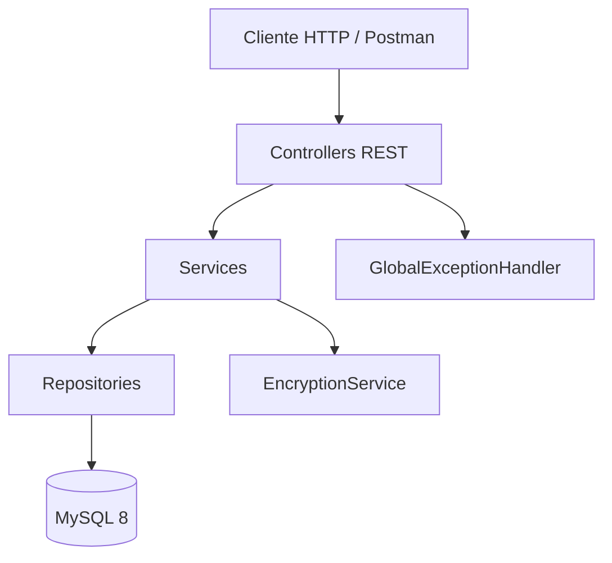
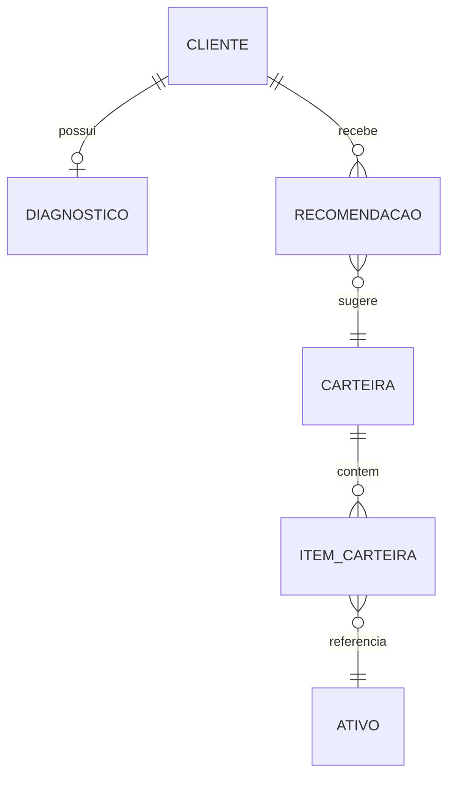
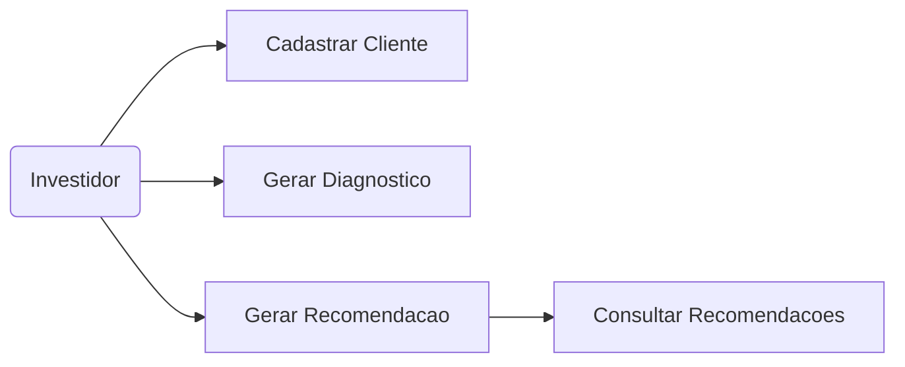

# Operum

## Grupo 3ESPF
- Rony Nagai | RM551549
- Tomaz Versolato | RM551417
- Pedro Valotto | 551445

## Visao Geral
Operum Advisor e um prototipo de assessor virtual de investimentos construido com Spring Boot e MySQL. A aplicacao cobre o ciclo de cadastro do cliente, diagnostico do perfil investidor e geracao de recomendacoes de carteiras pre-cadastradas, garantindo validacoes de LGPD e criptografia de dados sensiveis.

## Tecnologias
- Java 17
- Spring Boot 3 (Web, Data JPA, Validation, Security)
- MySQL 8
- Flyway para migracoes
- Maven Wrapper

## Configuracao e Execucao
1. Crie o banco `operum` no MySQL 8 (`CREATE DATABASE operum;`).
2. Ajuste as credenciais em `src/main/resources/application.properties` se necessario (padrao: usuario `root` senha `fiap`).
3. Rode as migracoes e inicie o servidor:
   ```bash
   ./mvnw spring-boot:run
   ```
4. Autentique-se usando HTTP Basic com `operum/operum123` (login padrao para todos os endpoints).

## Autenticacao
Todas as requisicoes exigem HTTP Basic com as credenciais padrao:
- Usuario: `operum`
- Senha: `operum123`
Adicionar o header `Authorization: Basic operum:operum123` (Postman define automaticamente ao escolher Basic Auth).

## Endpoints
### POST /clientes
Cadastra cliente com consentimento LGPD.
```http
POST /clientes
Authorization: Basic operum:operum123
Content-Type: application/json

{
  "nome": "Ana Silva",
  "cpf": "12345678909",
  "email": "ana@exemplo.com",
  "consentimentoLgpd": true,
  "objetivos": "Reserva de emergencia",
  "perfilRisco": "CONSERVADOR"
}
```

### GET /clientes
Lista todos os clientes cadastrados.
```http
GET /clientes
Authorization: Basic operum:operum123
```

### GET /clientes/{id}
Busca cliente especifico com dados descriptografados.
```http
GET /clientes/1
Authorization: Basic operum:operum123
```

### PUT /clientes/{id}
Atualiza os dados do cliente garantindo validacoes de LGPD e unicidade.
```http
PUT /clientes/1
Authorization: Basic operum:operum123
Content-Type: application/json

{
  "nome": "Ana Silva",
  "cpf": "12345678909",
  "email": "ana@exemplo.com",
  "consentimentoLgpd": true,
  "objetivos": "Reserva de emergencia",
  "perfilRisco": "MODERADO"
}
```

### DELETE /clientes/{id}
Remove cliente e recomenda-se remover diagnostico/recomendacoes associados manualmente.
```http
DELETE /clientes/1
Authorization: Basic operum:operum123
```

### POST /diagnostico
Gera ou atualiza diagnostico automatico com base no score informado.
```http
POST /diagnostico
Authorization: Basic operum:operum123
Content-Type: application/json

{
  "clienteId": 1,
  "scoreRisco": 45,
  "objetivosComplementares": "Comprar casa"
}
```

### POST /recomendacoes
Gera recomendacao de carteira alinhada ao perfil do cliente.
```http
POST /recomendacoes
Authorization: Basic operum:operum123
Content-Type: application/json

{
  "clienteId": 1,
  "valorDisponivel": 15000,
  "objetivo": "Aumentar patrimonio em 5 anos"
}
```

### GET /recomendacoes/{clienteId}
Retorna historico de recomendacoes do cliente.
```http
GET /recomendacoes/1
Authorization: Basic operum:operum123
```

## Seguranca e LGPD
- Autenticacao HTTP Basic com senha armazenada usando BCrypt.
- Campos sensiveis (nome, email, justificativas) sofrem criptografia AES/GCM via `EncryptedStringAttributeConverter`.
- Consentimento LGPD obrigatorio e validado no cadastro.
- Recomenda-se executar o prototipo sob HTTPS em ambientes reais para criptografia em transito.

## Migracoes
- `V1__create_schema.sql`: cria todas as tabelas e relacionamentos.
- `V2__seed_data.sql`: popula ativos e carteiras modelo para as recomendacoes.

## Diagramas
### Arquitetura em Camadas


### Diagrama ER Simplificado


### Casos de Uso Principais


## Proximos Passos Sugeridos
1. Adicionar testes automatizados para services e controllers.
2. Expor documentacao OpenAPI com springdoc.
3. Persistir dados de criptografia em cofre seguro (ex: HashiCorp Vault).
